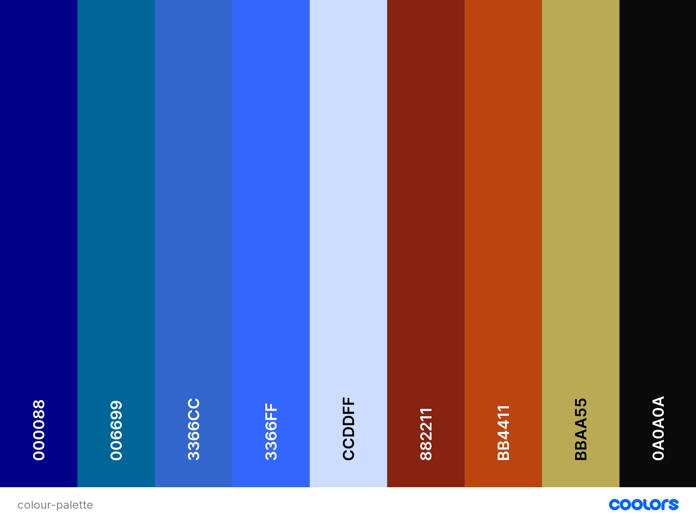
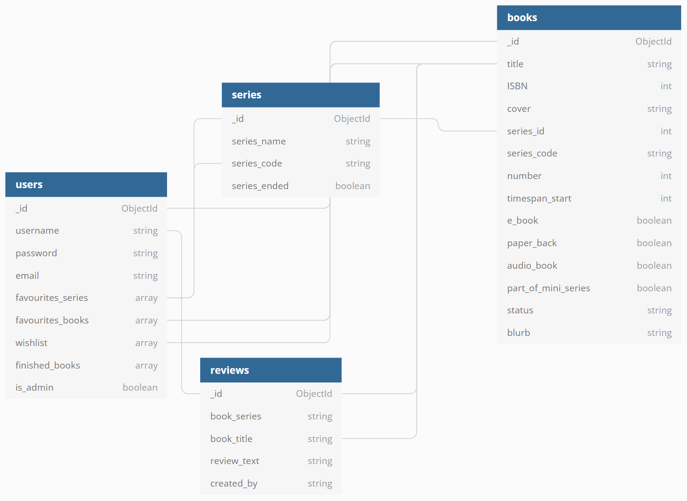

# **ST-Archive**

ST-Archive provides an overview of the novels from the various series across the Star Trek universe. Users can see the novels sorted by series, add books and/or reviews to the database, add favourites to their profiles, and delete favourites from their profiles and manage their data.

## **Deployed project**

The deployed project can be found [here](https://ms3-st-archive.herokuapp.com/).

## **User Experience**

---

---

### **User stories:**

---

#### **As a casual user:**

-   I want to be able to browse through the content without having to register first.
-   I want to be able to search for books by title.
-   I want to be able to see in what order the books have been published and/or should be read.
-   I want to be able to read reviews or some form of rating from other users.

#### **As a returning user:**

-   I want to be able to write a review for a book and post it to the site.
-   I want to be able to save books and series as favourites.
-   I want to be able to distinguish between books that I have read and that I haven't read yet.
-   I want to be able to see which books of a series I need to read to complete it or to be up to date.
-   I want to be able to add books that I haven't read or that haven't been published yet to add to a wish list.
-   I want to be able to add books to the site.
-   I want to be able to edit or delete my reviews, lists and reading progress.
-   I want to be able to contact the site owner with queries.
-   I want to be able to navigate the site by using a keyboard only.
-   I want to be able to hear the content by using a screen reader.

#### **As the site owner/admin:**

-   I want to be able to add new collections to the site.
-   I want to be able to edit collections.
-   I want to be able to delete collections.
-   I want to be able to delete reviews from users if they are spam, include hate speech, violate copyrights or any other form of unacceptable content.

### **Design**

---

#### **Colour Scheme**

To match the site's theme, the following colour scheme was created:
 It aims to replicate the familiar colours used for LCARS in Star Trek: The Next Generation. Please refer to the Credit section for more info.

#### **Typography**

To match the site's theme, the following fonts were used:

For headings, the Okuda font, which is based on the computer lettering (the LCARS system) created by Mike Okuda for Star Trek: The Next Generation, is used. A licence for personal, non-commercial purposes without limitations to the number of prints, pages, or other media to be produced using them, was obtained from the author at [pixelsagas.com](https://www.pixelsagas.com/).

For all other text the Millennium font, which is used on the hull of Starfleet vessels in the Star Trek movies and TV series, is used. A web fonts licence for 250000 pageviews was purchased at [fontshop.com](https://www.fontshop.com/).

Initially, the Millennium font was intended as the font for the headings and the Okuda font as the standard font. But due to user feedback about bad readability and the Millennium font not being displayed correctly, the fonts were swapped.

#### **Icons**

All icons are from [Font Awesome](https://fontawesome.com). Please refer to the Bug section for info about why not all buttons have been styled with icons.

#### **Imagery**

All images were taken from [Unsplash](https://unsplash.com). Credit for the individual pictures is given below in the media section.

### **Wireframes**

---

I used Balsamiq to plan the site’s layout for different viewports (mobile, tablet and desktop). To better demonstrate the differences, I sort my wireframes by page and show the versions for mobile, tablet and desktop next to each other.
All wireframes for this project can be found in the [wireframes sub-directory](https://github.com/Ryagg/st-archive/tree/main/wireframes).

### **Database Schema**

---

The project uses 4 collections which are stored in MongoDB.

-   The **users** collection stores the username, password and email to enable the user to create an account with a profile page and - as a future feature - to be notified when new books are added to a series from his favourites list. Books that have been added to either the favourites list or the wish list, and series that have been added to the favourites list, and all reviews written by the user are also stored. Furthermore, information about whether a user is also an admin are stored.

-   The **series** collection stores the name and the code (e.g. 'DSC' for 'Discovery') for each series. It also stores information about whether the series has ended.

-   The **books** collection stores the title, ISBN, blurb and number (within a series) of each book. It also holds the URL for the book cover as well as information about in which format (e-book, paper book and audiobook) the book is available and whether it is part of a mini-series. The 'timespan_start' is the year the story starts and can be used - as a future feature - to sort books by 'timespan'. The status can be either 'published' or 'announced'.

-   The **reviews** collection stores the ObjectId, the username from the user that wrote the review, the title and series of the book being reviewed, and the review itself.

## **Features**

---

---

### **Existing Features**

---

#### **Features on all pages: navbar**

The navigation menu is fixed to the top to allow the user quick and easy navigation through the site. For the series page, a dynamically generated dropdown menu is used to allow easy access without taking up too much space.
The available navigation menu items depend on whether a user is logged in and for some options also on whether a user is an admin:

| Nav Link           | Not logged in | Logged in as user | Logged in as admin |
| :----------------- | :------------ | :---------------- | :----------------- |
| Logo(back to home) | &#9989;       | &#9989;           | &#9989;            |
| Series             | &#9989;       | &#9989;           | &#9989;            |
| Reviews            | &#9989;       | &#9989;           | &#9989;            |
| Account            | &#9989;       | &#9989;           | &#9989;            |
| Register           | &#9989;       | &#10060;          | &#10060;           |
| Log In             | &#9989;       | &#10060;          | &#10060;           |
| Profile            | &#10060;      | &#9989;           | &#9989;            |
| Add Series         | &#10060;      | &#10060;          | &#9989;            |
| Add Books          | &#10060;      | &#10060;          | &#9989;            |
| Log Out            | &#10060;      | &#9989;           | &#9989;            |
| Copyright          | &#9989;       | &#9989;           | &#9989;            |
| Contact            | &#9989;       | &#9989;           | &#9989;            |

#### **Features on all pages: footer**

The footer is located at the bottom of each page and includes links to reach the website author on social media. The links open in a new browser tab.

#### **Home page: welcome section**

The welcome section consists of several short paragraphs informing the user about the site's aim, features and current status as a work in progress.

#### **Series page features**

The series page lists Star Trek novels sorted by series, e.g. "The Next Generation" or "Discovery". Currently, only a handful of books are included in the database, but the aim is to eventually list all books for all series. At the top of the page, a search bar is included where users can search both within book titles and blurbs. Results will be displayed beneath the search bar and can be cleared using the 'Reset' button.

At the start of the section for each series, users can add the whole series to their favourites.

The entry for each book includes the following information/data:

-   the book cover
-   the book number in the series or the info "Unnumbered book"
-   checkmarks indicating the available formats (ebook, paperback, and audiobook)
-   checkmark indicating whether the book is part of a miniseries
-   the blurb from the book cover
-   buttons for the user to add the book to his favourites, his wish list, to mark it as finished and to write a review

#### **Reviews page features**

The reviews page contains all reviews sorted by series. The card for each review displays the book title, the review text and the review author. The page is read-only for all users and admins.

#### **Register page features**

The register page contains a short instruction informing users which fields must be completed and also informs users that the fields for "Favourite series", "Favourite books", "Books in wish list", and "Finished books" can't be interacted with and that data from the user profile will be added there later automatically. To improve both user experience and accessibility each required field has "(required)" added next to the label and the fields for the user lists all have the read-only value of "leave empty". To further enhance user experience a "Clear form" button is placed next to the "Submit" button.

#### **Login page features**

The login page contains fields for users to enter their username and password and a "Log in" button. If wrong credentials are entered a generic error message is displayed to prevent hackers from getting information about usernames or passwords in the database.

#### **Profile page features**

The profile page greets users with a personalised flash message and heading. It contains the user's list for favourite series, favourite books, wish list and reviews. From here users can both edit and delete their reviews. In the case of deleting reviews, a modal with a confirmation dialogue gets displayed. At this point, users can either abort the process by clicking on "Cancel" or closing the modal by clicking on the "x" button in the top right corner of the modal. Only by clicking on "Delete review" inside the modal can users delete their reviews.

#### **Logout features**

After logging out a confirmation flash gets displayed. The session status is cleared.

#### **404 page**

Users who enter an incorrect URL for the site are being directed to the 404 page. The page features the numerical error code, a space-related image and a Star Trek related short explanation that there is no page to be displayed. Beneath, they can click on the link to be "beamed" back to the homepage.

#### **500 page**

In case of internal server errors, a 500 page is displayed. The page features the numerical error code, a space-related image and a Star Trek related short explanation that the request currently can't be fulfilled. Beneath, they can click on the link to "take a shuttle" back to the homepage.

#### **Admin features**

Admins can add both series and books to the database. They can also check user reviews before adding them to the reviews collection.

### **Features to be implemented**

---

#### **E-Mail notifications**

For users who have added series to their favourites, e-mail notifications about newly announced books in those series are planned.

#### **Password reset function**

For users who forgot their password, a password reset function is planned.

## **Technologies Used**

---

### **Languages**

---

-   [HTML5](https://developer.mozilla.org/en-US/docs/Web/Guide/HTML/HTML5)
-   [CSS3](https://developer.mozilla.org/en-US/docs/Web/CSS)
-   [Python](https://www.python.org/)
-   [JavaScript](https://developer.mozilla.org/en-US/docs/Web/JavaScript)

### **Libraries & Frameworks**

---

-   [Bulma](https://bulma.io/)
-   [Flask](https://flask.palletsprojects.com/en/2.0.x/)
-   [Jinja](https://jinja.palletsprojects.com/en/3.0.x/)
-   [Font Awesome](https://fontawesome.com/)

### **Tools**

---

-   [VSCode](https://code.visualstudio.com/)
-   [GitHub](https://github.com/)
-   [Heroku](https://www.heroku.com/)
-   [Google Chrome Developer Tools](https://developer.chrome.com/docs/devtools/)
-   [Sizzy](https://sizzy.co/)
-   [Balsamiq](https://balsamiq.com/)
-   [Coolors colour palette generator](https://coolors.co/)
-   [W3C HTML Validation Service](https://validator.w3.org/)
-   [W3C CSS Validation Service](https://jigsaw.w3.org/css-validator/)
-   [JSHint](https://jshint.com)
-   [TinyJPG](https://tinyjpg.com/)

## **Testing**

---

---

### **Testing User Stories**

---

Please refer to the separate [TESTING.md](TESTING.md)

### **Functionality Testing**

---

Please refer to the separate [TESTING.md](TESTING.md)

### **Usability Testing**

---

Please refer to the separate [TESTING.md](TESTING.md)

### **Compatibility Testing**

---

Please refer to the separate [TESTING.md](TESTING.md)

## **Bugs**

---

---

Please refer to the separate [TESTING.md](TESTING.md)

## **Deployment**

---

---

-   Forking
    If you wish to use this repository as a starting point or to propose changes to this project, you can fork it. Follow the steps below.

    1. Navigate to the repository [Ryagg/st-archive](https://github.com/Ryagg/st-archive)
    2. Click 'Fork' in the top-right corner.

-   Cloning
    Cloning a repository creates a local copy on your computer. Follow the steps below.

    1. Navigate to the repository [Ryagg/st-archive](https://github.com/Ryagg/st-archive)
    2. Click 'Code' above the list of files.
    3. In the new window, cloning using HTTPS is the default option. Copy the provided link manually or by clicking on the clipboard symbol.
    4. Open Git Bash.
    5. Navigate to your desired directory for the cloned project.
    6. Type 'git clone' followed by the URL copied in step 3.
    7. Press **Enter** to create your local clone.

-   Deploy remotely
    To deploy the site remotely on [Heroku](https://www.heroku.com/) please follow the steps below.
    1. Create either a **requirements.txt** file or a **Pipfile**, if using pipenv, to enable Heroku to install the required dependencies for the app.
    2. Create a **Procfile** with the content `web:python app.py`. Remove any blank lines at the end as they may cause errors.
    3. Register a free Heroku account, if you don't have one already, sign in and create the app.
    4. Select the **Deploy** tab and choose **Github** as **Deployment method**.
    5. Select the **Settings** tab and click on **Reveal Config Vars** in the section **Config Vars**. Enter your key-value-pairs from your **env.py** file without the quotes. The following variables should be added:
        - IP: `0.0.0.0`
        - PORT: `5000` (other ports may work as well)
        - SECRET_KEY: `<your secret key>`
    6. Push the **Procfile** to your Github repo.
    7. Back under the **Deploy** tab in Heroku enable **Automatic deploys**.
    8. Select the **main branch** and click on **Deploy branch**.
    9. Wait for the message 'Your app was successfully deployed' and then click **View** to start your app in the browser.

## **Credits**

---

---

The colours for my colour palette were taken from [Steven Cote's](https://codepen.io/Mokurunner) superb [LCARS Hex Chart on codepen](https://codepen.io/Mokurunner/pen/eqtHl). The licence can be found [here](https://codepen.io/Mokurunner/details/eqtHl) at the bottom of the page.

### **Media**

---

### **Content**

---

ST-Archive uses content derived from [Memory Alpha](http://memory-alpha.wikia.com/), therefore it is safe to assume that most of ST-Archive's content is licensed under [CC-BY-NC 4.0](https://creativecommons.org/licenses/by-nc/4.0/). For details on Memory Alpha licensing see this [link](https://memory-alpha.fandom.com/wiki/Memory_Alpha:Copyrights).

ST-Archive also uses content from [Memory Beta](http://memory-beta.wikia.com/), therefore some parts of the data are licensed under [CC BY-SA 3.0](https://creativecommons.org/licenses/by-sa/3.0/). For details on Memory Beta licensing see this [link](https://memory-beta.fandom.com/wiki/Memory_Beta:Copyrights).

### **Code**

---

### **Websites and Documentation**

-   [Bulma docs](https://bulma.io/documentation/)
-   [Flask docs](https://flask.palletsprojects.com/en/2.0.x/)
-   [Jinja docs](https://jinja.palletsprojects.com/en/3.0.x/)
-   [MongoDB docs](https://docs.mongodb.com/)
-   [Stackoverflow](https://stackoverflow.com/)
-   [CSS-tricks](https://css-tricks.com/)

### **Acknowledgements**

---

Many thanks to:

-   My mentor, Tim Nelson, for his great support and advice.
-   Amy O'Shea for her webinar 'Preparing for your MS3' and for allowing me to use and adapt her raw code for the table showing the status of the navigation buttons depending on the user status in my readme.
-   The tutors from Code Institute for their guidance.
-   Erik P. for his suggestions regarding the site's styling.
-   The always helpful and supportive CI slack community.
