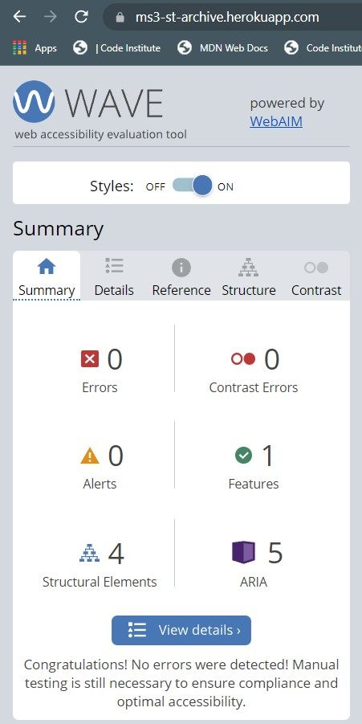

## **Testing User Stories**

### **User Requirements and Expectations**

The following user requirements and expectations were developed based on the user stories.

#### **Expectation: being able to browse through the content without having to register first**

-   Requirement: allow users to easily access the main content of the site without having to register or log in
-   Implementation: both the page for all books (sorted by title) and the page for all books of the selected series can be accessed through the navbar. The sticky navbar at the top of the page furthermore facilitates easy navigation. See the screenshots [here](images/readme/usertests/user-expectation-1.jpg) and [here](images/readme/usertests/user-expectation-1-example-2.jpg).

#### **Expectation: being able to search for books by title**

-   Requirement: allow users to search the database for book titles and display the result.
-   Implementation: using the Python interpreter in the command line a text index was created to allow users to search for titles and text from the blurbs within the books' collection:

          mongo.db.books.create_index([("title", "text"), ("blurb", "text")])

    A search bar has been placed at the top of the all_books and series pages. Search results are displayed beneath the search bar and by clicking on 'Reset' the user is redirected to the originating page. See a screenshot for a search result [here](images/readme/usertests/user-expectation-2.jpg).

#### **Expectation: being able to see in what order the books have been published and/or should be read**

-   Requirement: Retrieve and display information helping users discern the order of publication.
-   Implementation: Where available, the book number within a series is being displayed. For the pages displaying all books of a selected series, the titles are sorted by number. For series without numbering, the titles have been added to the database in their correct order and are displayed in this order. See the screenshots [here](images/readme/usertests/user-expectation-3.jpg) and [here](images/readme/usertests/user-expectation-3-example-2.jpg). The year in which the story of each book starts (timespan) has been added to the database where available. Currently, there is no option to sort books by timespan. This is both due to this information not being available for all books and Star Trek stories often having multiple storylines taking place in different timespans. And of course, there are stories featuring time travel.

#### **Expectation: being able to read reviews or some form of rating from other users**

-   Requirement: allow users to write reviews and let users see all available reviews. Let users rate books.
-   Implementation: Users who are logged in can [write reviews](images/readme/usertests/user-expectation-4.jpg). The correspondent button at the bottom of the card displaying the information for the selected book redirects the user to the review page. The series code and the book title are already entered into the form and are read-only. This is both to make it easier for the user and to prevent multiple entries for one book due to spelling errors or differences in capitalization. [All reviews](images/readme/usertests/user-expectation-4-example-2.jpg) are accessible through the navbar. The option to rate books has not been implemented. There are no immediate plans to implement this feature, but this decision might be reconsidered at a later time.

#### **Expectation: being able to write a review for a book and post it to the site**

-   Please refer to the above expectation.

#### **Expectation: being able to save books and series as favourites**

-   Requirement: allow users to mark selected books and series and display them as their favourites.
-   Implementation: each book and each series features an ['Add to favourites' button](images/readme/usertests/user-expectation-5.jpg) that adds the book or series to the favourites_books or favourites_series array of the currently logged in user. The items from those arrays are [displayed](images/readme/usertests/user-expectation-5-example-2.jpg) on the profile page. A flash message either confirms that the book or series has been added to the favourites or informs the user that the [book](images/readme/usertests/user-expectation-5-example-3.jpg) or [series](images/readme/usertests/user-expectation-5-example-4.jpg) couldn't be added because it already was in that list.

#### **Expectation: being able to distinguish between books that have already been read and those that have not been read by the user**

-   Requirement: allow users to add books to separate lists ('finished books' and 'wish list').
-   Implementation: like the above expectation this is implemented via [button](images/readme/usertests/user-expectation-6.jpg) and the [lists](images/readme/usertests/user-expectation-6-example-2.jpg) are displayed on the profile page. In contrast to the expectation above, there are no checks whether a book is already in 'the other list'. This is intentional because a Trekkie might e.g. have finished the audiobook version of a title and still want the paperback or e-book version of the same title or the same format but in another language.

#### **Expectation: being able to see which books of a series are needed to either complete it or be up to date**

-   Requirement: allow users to see a constantly updated list of all books for a series from which the titles marked as finished have been removed.
-   Implementation: This feature has not been implemented yet.

#### **Expectation: being able to add books that either have not been read yet or have not been published yet to a wish list**

-   Books, either published or not yet published, can be added to the wish list. Please refer to expectation 6 (2 above) for details.

#### **Expectation: being able to add books to the site**

-   This feature has not been implemented and there are no plans to implement it in the future. For the time being, new books are being added manually by me to the database. For later updates to the site, I plan to add books by web scraping.

#### **Expectation: being able to edit and delete reviews, lists and reading progress**

-   Requirement: allow users to modify their reviews, lists and reading progress and update the correspondent database documents.
-   Implementation: Each review on the profile page features [buttons](images/readme/usertests/user-expectation-7.jpg) that let users [edit](images/readme/usertests/user-expectation-7-example-1.jpg) and delete their reviews. In case of editing, the series code and the book title are already entered into the form and read-only. In case of deletion, a [confirmation modal](images/readme/usertests/user-expectation-7-example-2.jpg) lets users either confirm the deletion or cancel the process. This functionality has not been implemented for list and reading progress yet.

#### **Expectation: being able to contact the site owner**

-   Requirement: allow users to easily get in touch with the site owner.
-   Implementation: the site features a [contact page](images/readme/usertests/user-expectation-8.jpg) where users can send an email. A [flash message](images/readme/usertests/user-expectation-8-example-2.jpg) informs the user that the message has been received. In case of technical difficulties, [another flash message](images/readme/usertests/user-expectation-8-example-3.png) informs the user that the message could not be sent.

#### **Expectation: being able to navigate the site by using a keyboard only**

-   Requirement: make all relevant elements available with the Tab key and make all relevant interactions respond to the Enter key in addition to mouse clicks.
-   Implementation: I manually tested all elements on all pages. Where elements could not be focused using the Tab key,

        tabindex="0"

    was added to the HTML code. Please refer to commit ef9d1b16760f7315503dbd964822e05e4a9e005e.

    To enable keyboard interaction with the modal dialogue that appears when users want to delete their reviews, additional JS code was added. Please refer to commit cb55e3a3494df281d1dc168d6bc0ce1da595e255.

    To assist users in identifying the focused element, distinct :focus styles were added. Please refer to commit: 4268e7c1d6c1d161450e2618b17f548d04f32dc0.

#### **Expectation: being able to access the site by using a screen-reader**

-   Requirement: allow content and structure to be recognized by screen-readers.
-   Implementation: no additional measures were taken. When using the Windows 10 screen-reader all content could be heard and.

#### **Expectation: being able as an admin to add new collections to the site**

-   Requirement: allow users with admin privileges to add new series and books to the site
-   Implementation: for users with admin privileges [additional links](images/readme/usertests/user-expectation-9.jpg) are available in the navbar that redirect to the correspondent forms. See screenshots [here](images/readme/usertests/user-expectation-9-example-2.jpg) and [here](images/readme/usertests/user-expectation-9-example-3.jpg).

#### **Expectation: being able as an admin to edit collections**

-   This feature is not implemented. Currently, I do not plan to allow any other users to modify the collections and if I have to make changes myself I either log into my MongoDB account and modify the collections there or I use the MongoDB Compass application.

#### **Expectation: being able as an admin to delete collections**

-   See comment above.

#### **Expectation: as an admin, I want to be able to delete reviews from users if they contain any form of unacceptable content**

-   This feature is not implemented yet. In a future update to the site, I want to go one step further and check the reviews before adding them to the site.

---

---

## **Functionality Testing**

### **navbar**

**Plan**

Make the site easy to navigate by providing a fixed-top navbar and dropdown-menus for grouped content. A newly added series should automatically be added to the series dropdown menu.

**Test**

While logged in as an administrator, I jumped back and forth between all pages and added a new series.

**Result**

The navbar is visible on all pages except the error pages. This is intentional. Dropdown menus appear when hovered over or activated through the Tab key. All links redirect to the expected page. The new series appeared in the dropdown menu and was later deleted.

**Verdict**

Working as intended.

---

### **footer**

**Plan**

Display copyright for the page and social media links.

**Test**

Again I jumped back and forth between all pages. I also clicked on the social media links.

**Result**

Like the navbar, the footer is visible on all pages except the error pages. The social media links open the correspondent pages in a new tab.

**Verdict**

Working as intended.

---

### **Home page: welcome section**

**Plan**

The welcome section greets the user and gives a short description of the aim and features of the site. It also features a prominent link to the registration page.

**Test**

I felt compelled by the text to click on the link and register an account.

**Result**

The text informs users about the aim, features and current status of the site. The link redirects users to the registration page.

**Verdict**

Working as intended.

---

### **All books: pagination**

**Plan**

Prevent the user from having to scroll through too many books on a single page and reduce page loading times.

**Test**

Load the page on different devices and scroll to the end of the page.

**Result**

No more than 6 titles (the current per-page setting) are being displayed. A 'pagination bar' allows access to the following and/or the previous page either by clicking on the page number or by clicking on left- or right arrows. If there is no previous or next page the correspondent arrow is inactive and smaller.

**Verdict**

Working as intended.

---

### **All books and series page: search bar**

**Plan**

Allow the user to search both for book titles as well as within the blurbs and display the results. For convenience, the search can be found both on the all_books page and the series page.

**Test**

I started searches for words from titles and blurbs from both pages. I also searched for words that wouldn't be found in either the titles or the blurbs.

**Result**

If books are found they are being displayed correctly. If there are no books found, a message informs the user and also states how the user can go back to the previous page.

**Verdict**

Working as intended.

---

### **All books and series page: information about books**

**Plan**

Provide the user with the most important information about the title at a glance.

**Test**

Load the pages multiple times and compare the entries for several books.

**Result**

All data are picked up from the database and shown to the user.

**Verdict**

Working as intended.

---

### **All books and series page: user actions**

**Plan**

Provide users with a "one-click solution" to add books to various lists in their user profile. The available options are: add a book to favourites, add a book to wish list, mark a book as finished and add a review for a book. On the series page, the selected series can be added to favourites.

**Test**

Performing these actions multiple times both for different books and also the same book.

**Result**

Books are added to the correspondent list and a flash message informs the user about this. If a user tries to add a book (or series) to a list multiple times a flash message informs the user that the request has been denied.

**Verdict**

Working as intended.

---

### **Review page**

**Plan**

Provide the user with easy access to all available reviews sorted by series and within a series by number.

**Test**

Write several reviews and check the results.

**Result**

All reviews are sorted by series. Within a series, the reviews are sorted by book number. Reviews for unnumbered books are sorted by title. Reviews for the same title appear in the order they have been published.

**Verdict**

Working as intended.

### **Register page**

**Plan**

Allow users to create an account to use all available features. Prevent multiple accounts with the same username.

**Test**

Create several user accounts and register them. Use both unique usernames and also try to register with an already existing username.

**Result**

Accounts with unique usernames get created and the user is redirected to the profile page. Trying to register an account with an already existing username leads to an error message and the registration form is cleared.

**Verdict**

Working as intended.

---

### **Login page**

**Plan**

Allow users to access their profile and be able to distinguish between guests and logged in users. Prevent users who are not logged in from accessing features that are only available for registered and logged in users.

**Test**

Enter username and password to log into my accounts. Try to access features without being logged in.

**Result**

After logging into the site, users are redirected to their profile page. Trying to e.g. add a book to my favourites without being logged in leads to an error message and redirection to the login page.

**Verdict**

Working as intended.

---

### **Profile page: overview**

**Plan**

Provide the user with an overview of the generated lists and allow access to user actions. Currently, users can edit and delete their reviews.

**Test**

Log in to my account and check the content of my lists.

**Result**

All lists and their contents are being displayed correctly.

**Verdict**

Working as intended.

### **Profile page: user actions**

**Plan**

Allow users to update or delete items on their lists. Currently, this feature is only available for reviews. In case of deleting reviews, a safeguard should be in place to prevent accidental deletion.

**Test**

Click on the 'Edit review' or 'Delete review' button and either continue with the process or cancel it.

**Result**

Clicking on 'Edit review' redirects to a form where the series code and book title are read-only. The text of the review is being displayed and can be modified. 'Submit' updates the review in the database and the profile. Users get redirected to their profile and see a confirmation message about the update. 'Cancel' redirects users back to their profile page. Clicking on 'Delete review' displays a confirmation dialogue informing the user that the review will be deleted from their profile and the database. 'Delete review' will delete the review. Users get redirected to their profile page and see a confirmation message about the deletion. 'Cancel' or 'x' redirect users to their profile page.

**Verdict**

Working as intended.

---

### **Profile page: admin actions**

**Plan**

Allow admins to perform actions on the collections. Currently, admins can add series and books to the correspondent collections.

**Test**

While logged in as admin, use the links that are only being displayed for admins to perform the actions. Please refer also to the security test further below.

**Result**

Both links lead to forms. Client-side form validation is used on most, but not all fields. E.g. the measures necessary to check for a valid URL for the book cover were deemed too time-consuming and therefore any text will be accepted. Submitting the forms adds the book or series to their corresponding collections and the book or series will be displayed on the site.

**Verdict**

Working as intended.

---

### **Logout**

**Plan**

Log out the user, clear the session cookie and allow other users to log in from the same machine.

**Test**

Log out.

**Result**

Logging out and then trying to access e.g. the profile page leads to an error message and the user is redirected to the login page.

**Verdict**

Working as intended.

---

### **Error pages**

**Plan**

In case of a page not being available due to either an invalid URL or a server error, provide users with a short explanation and an easy way back to the homepage.

**Test**

For the 404 page, I added several letters to the URL of a correctly displayed page. I could not (and did not want to) cause a server error. To test the page, I temporarily replaced the URL for the '404' page with the one for the '500' page in the app route.

**Result**

Entering an invalid URL leads to the 404 page and provides a link back to the homepage. The header and footer are not being displayed.

**Verdict**

Working as intended for the 404 page. Since the code for the '500' page is practically identical, I have no reason to doubt that it works as well.

---

### **Security**

**Plan**

Provide as much security for my users and their data as well as the site itself as possible. Measures taken include the use of an admin decorator, template logic to decide which links a user should see in the navbar and the use of Talisman and SeaSurf.

**Test**

Enter a wrong password or username. Try to log in while being logged in with another account. Try to add books to one of the various lists, write a review, or manually enter the URLs for adding series or books while not being logged in. Manually enter the URLs for adding series or books while being logged in as a user, but not as an admin. Try to run scripts without nonce.

**Result**

Both entering a wrong password or a wrong username lead to the same generic error message ("Incorrect Username and/or Password."). Logging in while another user is currently logged in is possible, but the session cookie for the previous user gets cleared and the new user can only access his profile and perform actions that are allowed for his account status as a user or admin. Trying to access any of the features that require the user to be logged in without being logged in leads to the same error message in all cases ("Security alert: Access restricted. Authentication required. Enter credentials.") and redirect the user to the login page. Trying to access admin features without being an admin leads to another error message ("Security alert: Authorisation Alpha-Theta required. Access denied."). The user stays on the current page. Trying to run a script without nonce leads to the script not being loaded and a console error. Logging in does not lead to a warning from the browser that the data are being sent unencrypted.

**Verdict**

Totally working as intended!

### **Accessibility**

**Plan**

Make the site as accessible as possible. Let all elements and interactions be accessible for keyboard-only users. Make focused items easily distinguishable. Use good contrast. Don't convey meaning through colours alone. Use ARIA-labels where appropriate. Give clear instructions. Use tooltips.

**Test**

Use all aspects of the site with a keyboard only. Use the [web accessibility evaluation tool](https://wave.webaim.org/). For WAVE results please refer to the Validators section further below. Use the Windows 10 screen-reader.

**Result**

JS had to be added to make all elements and interactions accessible for keyboard-only users. Now all relevant elements can be focused through the Tab key and chosen/activated through the Enter key or the Spacebar and closed with Escape.

**Verdict**

Working as intended. However, I have no experience in using a screen-reader and can't judge how easy my site is to use for users relying on a screen-reader. The same restriction applies to most forms of disabilities. While I have taken great care to make my site accessible for as many users with different forms of disabilities as my current skills and knowledge allow, I can't be sure of the results.

---

---

## **Validators**

### **W3C Markup Validator**

For validating my HTML code the source code from each page of the generated live site was copied and pasted into the validator on [W3C Markup Validation Service](https://validator.w3.org/). At first, several errors due to aria-described-by labels and missing closing button tags were reported. These errors have been fixed and the tests repeated. The results are presented below:

-   all pages: 1 warning about a lacking section heading. The section is used for flash messages.
-   https://ms3-st-archive.herokuapp.com/: no errors were reported.
-   https://ms3-st-archive.herokuapp.com/all_books/: no errors reported.
-   https://ms3-st-archive.herokuapp.com/series/61587a31dcc215bfa1c93151 was checked as an example for all series-pages. No errors were reported.
-   https://ms3-st-archive.herokuapp.com/reviews: two kinds of errors are repeatedly shown due to the for-loop in the code:
    -   "Bad value 'series name' for attribute id on element h1: An ID must not contain whitespace." The code can be seen [here](images/readme/w3c-markup-error.jpg). The template-variable does not contain whitespace, but three of the Star Trek shows (Next Generation, Deep Space Nine and Original Series) have whitespace in their names.
    -   "Duplicate ID show.series_name". This is inside a for-loop and being replaced by the name of each series on the rendered page.
-   https://ms3-st-archive.herokuapp.com/register: no errors were reported.
-   https://ms3-st-archive.herokuapp.com/login: no errors were reported.
-   https://ms3-st-archive.herokuapp.com/add_review/?title=Caretaker: no errors were reported.
-   https://ms3-st-archive.herokuapp.com/edit_review/618fb8b5a27730238f72e6ba: no errors were reported.
-   https://ms3-st-archive.herokuapp.com/add_series: no errors were reported.
-   https://ms3-st-archive.herokuapp.com/add_book: no errors were reported.
-   https://ms3-st-archive.herokuapp.com/copyrights: no errors were reported.
-   https://ms3-st-archive.herokuapp.com/contact: no errors were reported.

### **W3CSS Validator**

The [W3C CSS Validation Service](https://jigsaw.w3.org/css-validator/) reported no errors. 20 warnings were reported due to vendor extensions.

### **WAVE Validator**

The [web accessibility evaluation tool](https://wave.webaim.org/) was used to check the site's accessibility features.

An exemplary image of the summary for the homepage is shown below. For all other pages, a summary in text form will be given. The images for all pages can be found in the [wave-results sub-directory](https://github.com/Ryagg/st-archive/tree/main/images/readme/wave-results).

-   **all_books page**: 0 errors, 0 contrast errors, 0 alerts, 14 features, 24 structural elements, 34 x ARIA
-   **series_page** (Discovery, exemplary for all series_pages): 0 errors, 0 contrast errors, 0 alerts, 18 features, 28 structural elements, 39 x ARIA
-   **reviews page**: 0 errors, 0 contrast errors, 0 alerts, 1 feature, 17 structural elements, 5 x ARIA
-   **copyright page**: 0 errors, 0 contrast errors, 0 alerts, 1 feature, 5 structural elements, 5 x ARIA
-   **contact page**: 0 errors, 0 contrast errors, 0 alerts, 5 features, 4 structural elements, 9 x ARIA
-   **register page**: 0 errors, 0 contrast errors, 0 alerts, 4 features, 13 structural elements, 16 x ARIA
-   **login page**: 0 errors, 0 contrast errors, 0 alerts, 3 features, 4 structural elements, 10 x ARIA
-   **add_review page**: 0 errors, 0 contrast errors, 0 alerts, 4 features, 4 structural elements, 5 x ARIA
-   **profile page**: 0 errors, 0 contrast errors, 1 alerts, 1 features, 30 structural elements, 11 x ARIA. The alert resulted from one of my test reviews consisting only of two words ("Test review") and it therefore appeared to be a heading instead of a paragraph.
-   **edit_review page**: 0 errors, 0 contrast errors, 0 alerts, 4 features, 4 structural elements, 5 x ARIA
-   **profile page with modal-dialogue for review-deletion**: 0 errors, 0 contrast errors, 1 alerts, 1 features, 30 structural elements, 11 x ARIA. The alert resulted again from the short paragraph for the test review.
-   **add_series page**: 0 errors, 0 contrast errors, 0 alerts, 3 features, 4 structural elements, 9 x ARIA
-   **add_book page**: 0 errors, 0 contrast errors, 5 alerts, 12 features, 4 structural elements, 23 x ARIA. 4 of the alerts resulted from short paragraphs ("Available as ebook?", "Available as paperback?", "Available as audiobook?" and "Part of mini-series?") that appeared to be headings. The 5th alerts results from a missing label for the select element. Adding an additional label tag did not fix the alert and even led to an error in the W3C Markup validator. I don't know else to fix it.

### **Lighthouse**

### **JShint**

No errors were reported for script.js or hideOnErrorPages.js using [JSHint](https://jshint.com/). No tests were done for mtiFontTrackingCode.js because that code was not written by me but I had to add it per the license for the Millennium font. It also causes an uncaught TypeError in the console.

### **Python**

[PEP8 online](http://pep8online.com/) reported 1 error E202 ("expected 2 blank lines, found 1") in line 117. However, both in the copy-pasted code in the validator and the app.py file neither [line 117 nor lines 116 and 118](images/readme/pep8-error.jpg) are blank. No errors were reported from the pylint-extension.

## **Route Handlers**

## **Usability Testing**

## **Compatibility Testing**
