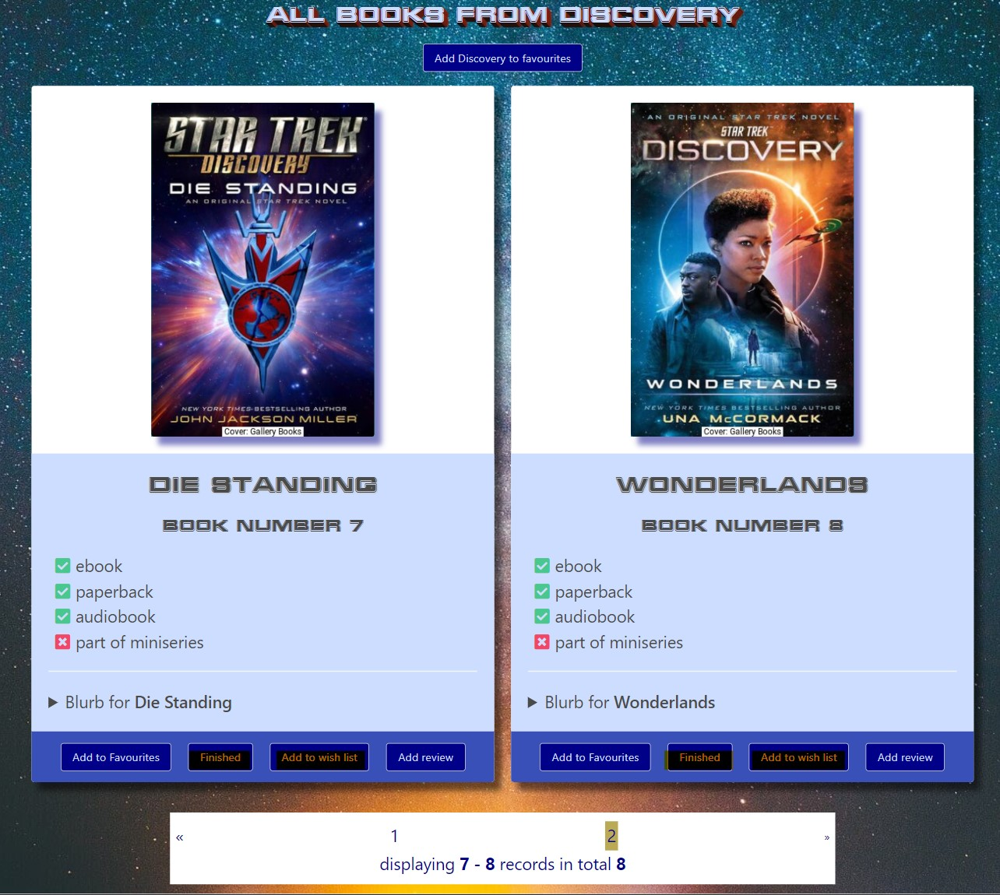
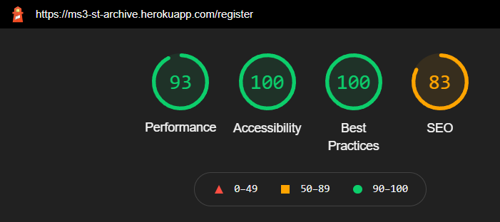
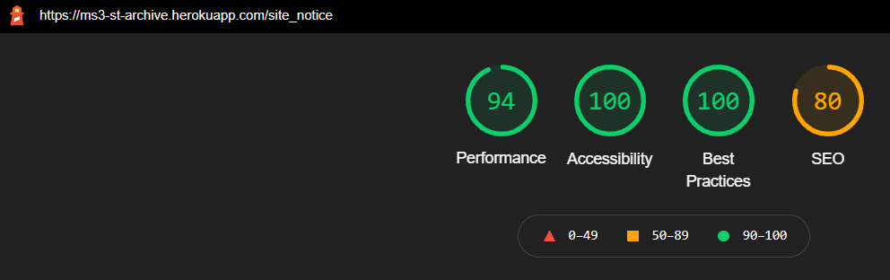

## **Testing User Stories**

### **User Requirements and Expectations**

The following user requirements and expectations were developed based on the user stories.

#### **Expectation: being able to browse through the content without having to register first**

-   Requirement: allow users to easily access the main content of the site without having to register or log in
-   Implementation: both the page for all books (sorted by title) and the page for all books of the selected series can be accessed through the navbar. The sticky navbar at the top of the page furthermore facilitates easy navigation. See the screenshots [here](documentation/testing/usertests/user-expectation-1.jpg) and [here](documentation/testing/usertests/user-expectation-1-example-2.jpg).

#### **Expectation: being able to search for books by title**

-   Requirement: allow users to search the database for book titles and display the result.
-   Implementation: using the Python interpreter in the command line a text index was created to allow users to search for titles and text from the blurbs within the books' collection:

          mongo.db.books.create_index([("title", "text"), ("blurb", "text")])

    A search bar has been placed at the top of the all_books and series pages. Search results are displayed beneath the search bar and by clicking on 'Reset' the user is redirected to the originating page. See a screenshot for a search result [here](documentation/testing/usertests/user-expectation-2.jpg).

#### **Expectation: being able to see in what order the books have been published and/or should be read**

-   Requirement: Retrieve and display information helping users discern the order of publication.
-   Implementation: Where available, the book number within a series is being displayed. For the pages displaying all books of a selected series, the titles are sorted by number. For series without numbering, the titles have been added to the database in their correct order and are displayed in this order. See the screenshots [here](documentation/testing/usertests/user-expectation-3.jpg) and [here](documentation/testing/usertests/user-expectation-3-example-2.jpg). The year in which the story of each book starts (timespan) has been added to the database where available. Currently, there is no option to sort books by timespan. This is both due to this information not being available for all books and Star Trek stories often having multiple storylines taking place in different timespans. And of course, there are stories featuring time travel.

#### **Expectation: being able to read reviews or some form of rating from other users**

-   Requirement: allow users to write reviews and let users see all available reviews. Let users rate books.
-   Implementation: Users who are logged in can [write reviews](documentation/testing/usertests/user-expectation-4.jpg). The correspondent button at the bottom of the card displaying the information for the selected book redirects the user to the review page. The series code and the book title are already entered into the form and are read-only. This is both to make it easier for the user and to prevent multiple entries for one book due to spelling errors or differences in capitalization. [All reviews](documentation/testing/usertests/user-expectation-4-example-2.jpg) are accessible through the navbar. The option to rate books has not been implemented. There are no immediate plans to implement this feature, but this decision might be reconsidered at a later time.

#### **Expectation: being able to write a review for a book and post it to the site**

-   Please refer to the above expectation.

#### **Expectation: being able to save books and series as favourites**

-   Requirement: allow users to mark selected books and series and display them as their favourites.
-   Implementation: each book and each series features an ['Add to favourites' button](documentation/testing/usertests/user-expectation-5.jpg) that adds the book or series to the favourites_books or favourites_series array of the currently logged in user. The items from those arrays are [displayed](documentation/testing/usertests/user-expectation-5-example-2.jpg) on the profile page. A flash message either confirms that the book or series has been added to the favourites or informs the user that the [book](documentation/testing/usertests/user-expectation-5-example-3.jpg) or [series](documentation/testing/usertests/user-expectation-5-example-4.jpg) couldn't be added because it already was in that list.

#### **Expectation: being able to distinguish between books that have already been read and those that have not been read by the user**

-   Requirement: allow users to add books to separate lists ('finished books' and 'wish list').
-   Implementation: like the above expectation this is implemented via [button](documentation/testing/usertests/user-expectation-6.jpg) and the [lists](documentation/testing/usertests/user-expectation-6-example-2.jpg) are displayed on the profile page. In contrast to the expectation above, there are no checks whether a book is already in 'the other list'. This is intentional because a Trekkie might e.g. have finished the audiobook version of a title and still want the paperback or e-book version of the same title or the same format but in another language.

#### **Expectation: being able to see which books of a series are needed to either complete it or be up to date**

-   Requirement: allow users to see a constantly updated list of all books for a series from which the titles marked as finished have been removed.
-   Implementation: This feature has not been implemented yet.

#### **Expectation: being able to add books that either have not been read yet or have not been published yet to a wish list**

-   Books, either published or not yet published, can be added to the wish list. Please refer to expectation 6 (2 above) for details.

#### **Expectation: being able to add books to the site**

-   This feature has not been implemented and there are no plans to implement it in the future. For the time being, new books are being added manually by me to the database. For later updates to the site, I plan to add books by web scraping.

#### **Expectation: being able to edit and delete reviews, lists and reading progress**

-   Requirement: allow users to modify their reviews, lists and reading progress and update the correspondent database documents.
-   Implementation: Each review on the profile page features [buttons](documentation/testing/usertests/user-expectation-7.jpg) that let users [edit](documentation/testing/usertests/user-expectation-7-example-1.jpg) and delete their reviews. In case of editing, the series code and the book title are already entered into the form and read-only. In case of deletion, a [confirmation modal](documentation/testing/usertests/user-expectation-7-example-2.jpg) lets users either confirm the deletion or cancel the process. This functionality has not been implemented for list and reading progress yet.

#### **Expectation: being able to contact the site owner**

-   Requirement: allow users to easily get in touch with the site owner.
-   Implementation: the site features a [contact page](documentation/testing/usertests/user-expectation-8.jpg) where users can send an email. A [flash message](documentation/testing/usertests/user-expectation-8-example-2.jpg) informs the user that the message has been received. In case of technical difficulties, [another flash message](documentation/testing/usertests/user-expectation-8-example-3.png) informs the user that the message could not be sent.

#### **Expectation: being able to navigate the site by using a keyboard only**

-   Requirement: make all relevant elements available with the Tab key and make all relevant interactions respond to the Enter key in addition to mouse clicks.
-   Implementation: I manually tested all elements on all pages. Where elements could not be focused using the Tab key,

        tabindex="0"

    was added to the HTML code. Please refer to commit [ef9d1b16760f7315503dbd964822e05e4a9e005e](https://github.com/Ryagg/st-archive/commit/ef9d1b16760f7315503dbd964822e05e4a9e005e).

    To enable keyboard interaction with the modal dialogue that appears when users want to delete their reviews, additional JS code was added. Please refer to commit [cb55e3a3494df281d1dc168d6bc0ce1da595e255](https://github.com/Ryagg/st-archive/commit/cb55e3a3494df281d1dc168d6bc0ce1da595e255).

    To assist users in identifying the focused element, distinct :focus styles were added. Please refer to commit: [4268e7c1d6c1d161450e2618b17f548d04f32dc0](https://github.com/Ryagg/st-archive/commit/4268e7c1d6c1d161450e2618b17f548d04f32dc0).

#### **Expectation: being able to access the site by using a screen-reader**

-   Requirement: allow content and structure to be recognized by screen-readers.
-   Implementation: no additional measures were taken. When using the Windows 10 screen-reader all content could be heard.

#### **Expectation: being able as an admin to add new collections to the site**

-   Requirement: allow users with admin privileges to add new series and books to the site
-   Implementation: for users with admin privileges [additional links](documentation/testing/usertests/user-expectation-9.jpg) are available in the navbar that redirect to the correspondent forms. See screenshots [here](documentation/testing/usertests/user-expectation-9-example-2.jpg) and [here](documentation/testing/usertests/user-expectation-9-example-3.jpg).

#### **Expectation: being able as an admin to edit collections**

-   This feature is not implemented. Currently, I do not plan to allow any other users to modify the collections and if I have to make changes myself I either log into my MongoDB account and modify the collections there or I use the MongoDB Compass application.

#### **Expectation: being able as an admin to delete collections**

-   See comment above.

#### **Expectation: as an admin, I want to be able to delete reviews from users if they contain any form of unacceptable content**

-   This feature is not implemented yet. In a future update to the site, I want to go one step further and check the reviews before adding them to the site.

---

---

## **Functionality Testing**

### **Security**

**Plan**

Provide as much security for my users and their data as well as the site itself as possible. Measures taken include:

-   #### **the use of Talisman**

    Talisman provides HTTP security headers for Flask. It helps to protect against multiple web application security issues, e.g. clickjacking, and it enables HTTP Strict Transport Security. A Content Security Policy has been created to ensure that only resources from whitelisted domains can be loaded. Additionally, all scripts need to have a nonce to be allowed to run. Scripts without a nonce will not be executed and a console error will be logged. For more information about Talisman, please refer to https://github.com/GoogleCloudPlatform/flask-talisman

-   #### **the use of Flask-SeaSurf**

    SeaSurf protects against cross-site request forgery. Please refer to https://flask-seasurf.readthedocs.io/en/latest/ for more information about SeaSurf.

-   #### **the use of an admin decorator**

    To prevent logged in users from accessing restricted functions an admin decorator was created and added to the correspondent views.

-   #### **template logic to decide which links a user should see in the navbar**

    Depending on the session-status users see a varying number of links in the navbar under 'Account'. Logged in users can visit their profile page and logout. Admins have the additional options to add series and books to the database. Guests can register an account and login.

**Test**

Enter a wrong password or username. Try to log in while being logged in with another account. Try to add books to one of the various lists, write a review, or manually enter the URLs for adding series or books while not being logged in by manually entering the URL. Manually enter the URLs for adding series or books while being logged in as a user, but not as an admin. Try to edit the review of another user. Try to run scripts without nonce.

**Result**

Both entering a wrong password or a wrong username lead to the same generic error message ("Incorrect Username and/or Password."). Logging in while another user is currently logged in is possible, but the session cookie for the previous user gets cleared and the new user can only access his profile and perform actions that are allowed for his account status as a user or admin. Trying to access any of the features that require the user to be logged in without currently being logged in leads to the same error message in all cases ("Security alert: Access restricted. Authentication required. Enter credentials.") and redirect the user to the login page. Trying to access admin features without being an admin leads to another error message ("Security alert: Authorisation Alpha-Theta required. Access denied."). The user stays on the current page. Trying to edit another user's review by manually entering the URL leads to an error message ("Security alert: Insufficient privileges. Access denied."). Trying to run a script without nonce leads to the script not being loaded and a console error. Logging in does not lead to a warning from the browser that the data are being sent unencrypted.

**Verdict**

&#9989; &#9989; Totally working as intended!

---

### **Accessibility**

**Plan**

Make the site as accessible as possible. Let all elements and interactions be accessible for keyboard-only users. Make focused items easily distinguishable. Use good contrast. Don't convey meaning through colours alone. Use ARIA-labels where appropriate. Give clear instructions. Use tooltips.

**Test**

Use all aspects of the site with a keyboard only. Use the [web accessibility evaluation tool](https://wave.webaim.org/). For WAVE results please refer to the Validators section further below. Use the Windows 10 screen-reader.

**Result**

JS had to be added to make all elements and interactions accessible for keyboard-only users. Now all relevant elements can be focused through the Tab key and chosen/activated through the Enter key or the Spacebar and closed with Escape.

**Verdict**

&#9989; Working as intended. However, I have no experience in using a screen-reader and can't judge how easy my site is to use for users relying on a screen-reader. The same restriction applies to most forms of disabilities. While I have taken great care to make my site accessible for as many users with different forms of disabilities as my current skills and knowledge allow, I can't be sure of the results.

---

### **navbar**

**Plan**

Make the site easy to navigate by providing a fixed-top navbar and dropdown-menus for grouped content. A newly added series should automatically be added to the series dropdown menu.

**Test**

While logged in as an administrator, I jumped back and forth between all pages and added a new series.

**Result**

The navbar is visible on all pages except the error pages. This is intentional. Dropdown menus appear when hovered over or activated through the Tab key. All links redirect to the expected page. The new series appeared in the dropdown menu and was later deleted.

**Verdict**

&#9989; Working as intended.

---

### **footer**

**Plan**

Display copyright for the page and social media links.

**Test**

Again I jumped back and forth between all pages. I also clicked on the social media links.

**Result**

Like the navbar, the footer is visible on all pages except the error pages. The social media links open the correspondent pages in a new tab.

**Verdict**

&#9989; Working as intended.

---

### **Home page: welcome section**

**Plan**

The welcome section greets the user and gives a short description of the aim and features of the site. It also features a prominent link to the registration page.

**Test**

I felt compelled by the text to click on the link and register an account.

**Result**

The text informs users about the aim, features and current status of the site. The link redirects users to the registration page.

**Verdict**

&#9989; Working as intended.

---

### **All books: pagination**

**Plan**

Prevent the user from having to scroll through too many books on a single page and reduce page loading times.

**Test**

Load the page on different devices and scroll to the end of the page.

**Result**

No more than 6 titles (the current per-page setting) are being displayed. A 'pagination bar' allows access to the following and/or the previous page either by clicking on the page number or by clicking on left- or right arrows. If there is no previous or next page the correspondent arrow is inactive and smaller.

**Verdict**

&#9989; Working as intended.

---

### **All books and series page: search bar**

**Plan**

Allow the user to search both for book titles as well as within the blurbs and display the results. For convenience, the search can be found both on the all_books page and the series page.

**Test**

I started searches for words from titles and blurbs from both pages. I also searched for words that wouldn't be found in either the titles or the blurbs.

**Result**

If books are found they are being displayed correctly. If there are no books found, a message informs the user and also states how the user can go back to the previous page.

**Verdict**

&#9989; Working as intended.

---

### **All books and series page: information about books**

**Plan**

Provide the user with the most important information about the title at a glance.

**Test**

Load the pages multiple times and compare the entries for several books.

**Result**

All data are picked up from the database and shown to the user.

**Verdict**

&#9989; Working as intended.

---

### **All books and series page: user actions**

**Plan**

Provide users with a "one-click solution" to add books to various lists in their user profile. The available options are: add a book to favourites, add a book to wish list, mark a book as finished and add a review for a book. On the series page, the selected series can be added to favourites.

**Test**

Performing these actions multiple times both for different books and also the same book.

**Result**

Books are added to the correspondent list and a flash message informs the user about this. If a user tries to add a book (or series) to a list multiple times a flash message informs the user that the request has been denied.

**Verdict**

&#9989; Working as intended.

---

### **Review page**

**Plan**

Provide the user with easy access to all available reviews sorted by series and within a series by number.

**Test**

Write several reviews and check the results.

**Result**

All reviews are sorted by series. Within a series, the reviews are sorted by book number. Reviews for unnumbered books are sorted by title. Reviews for the same title appear in the order they have been published.

**Verdict**

&#9989; Working as intended.

### **Register page**

**Plan**

Allow users to create an account to use all available features. Prevent multiple accounts with the same username.

**Test**

Create several user accounts and register them. Use both unique usernames and also try to register with an already existing username.

**Result**

Accounts with unique usernames get created and the user is redirected to the profile page. Trying to register an account with an already existing username leads to an error message and the registration form is cleared.

**Verdict**

&#9989; Working as intended.

## 

### **Login page**

**Plan**

Allow users to access their profile and be able to distinguish between guests and logged in users. Prevent users who are not logged in from accessing features that are only available for registered and logged in users.

**Test**

Enter username and password to log into my accounts.

**Result**

After logging into the site, users are redirected to their profile page. Entering incorrect data leads to a generic error message and the user is redirected to the login page.

**Verdict**

&#9989; Working as intended.

---

### **Profile page: overview**

**Plan**

Provide the user with an overview of the generated lists and allow access to user actions. Currently, users can edit and delete their reviews.

**Test**

Log in to my account and check the content of my lists.

**Result**

All lists and their contents are being displayed correctly.

**Verdict**

&#9989; Working as intended.

### **Profile page: user actions**

**Plan**

Allow users to update or delete items on their lists. Currently, this feature is only available for reviews. In case of deleting reviews, a safeguard should be in place to prevent accidental deletion.

**Test**

Click on the 'Edit review' or 'Delete review' button and either continue with the process or cancel it.

**Result**

Clicking on 'Edit review' redirects to a form where the series code and book title are read-only. The text of the review is being displayed and can be modified. 'Submit' updates the review in the database and the profile. Users get redirected to their profile and see a confirmation message about the update. 'Cancel' redirects users back to their profile page. Clicking on 'Delete review' displays a confirmation dialogue informing the user that the review will be deleted from their profile and the database. 'Delete review' will delete the review. Users get redirected to their profile page and see a confirmation message about the deletion. 'Cancel' or 'x' redirect users to their profile page.

**Verdict**

&#9989; Working as intended.

---

### **Profile page: admin actions**

**Plan**

Allow admins to perform actions on the collections. Currently, admins can add series and books to the correspondent collections.

**Test**

While logged in as admin, use the links that are only being displayed for admins to perform the actions. Please refer also to the security test further above.

**Result**

Both links lead to forms. Client-side form validation is used on all required fields. Submitting the forms adds the book or series to their corresponding collections and the book or series will be displayed on the site.

**Verdict**

&#9989; Working as intended.

---

### **Logout**

**Plan**

Log out the user, clear the session cookie and allow other users to log in from the same machine.

**Test**

Log out.

**Result**

Logging out and then trying to access e.g. the profile page leads to an error message and the user is redirected to the login page.

**Verdict**

&#9989; Working as intended.

---

### **Error pages**

**Plan**

In case of a page not being available due to either an invalid URL or a server error, provide users with a short explanation and an easy way back to the homepage.

**Test**

For the 404 page, I added several letters to the URL of a correctly displayed page. I could not (and did not want to) cause a server error. To test the page, I temporarily replaced the URL for the '404' page with the one for the '500' page in the app route.

**Result**

Entering an invalid URL leads to the 404 page and provides a link back to the homepage. The header and footer are not being displayed.

**Verdict**

&#9989; Working as intended for the 404 page. Since the code for the '500' page is practically identical, I have no reason to doubt that it works as well.

---

---

## **Validators**

### **W3C Markup Validator**

For validating my HTML code at first the source code from each page of the generated live site was copied and pasted into the validator on [W3C Markup Validation Service](https://validator.w3.org/). At first, several errors due to aria-described-by labels and missing closing button tags were reported. These errors have been fixed and the tests repeated. The last test runs were done using 'Check by address'. The results are presented below:

-   all pages: 1 warning about a lacking section heading. The section is used for flash messages.
-   all pages: 1 warning about CSP HTTP header: nonce-value should be at least 128 bits long.
-   homepage: no errors were reported.
-   all books page: no errors were reported.
-   series page(Discovery) was checked as an example for all series-pages. No errors were reported.
-   reviews page: no errors were reported.
-   register page: no errors were reported.
-   login page: no errors were reported.
-   add review page: no errors were reported.
-   edit review page: no errors were reported.
-   add series page: no errors were reported.
-   add book page: no errors were reported.
-   copyrights page: no errors were reported.
-   contact page: no errors were reported.

Result for homepage:

---

Result for all books page:

---

Result for series page with Discovery selected:

---

Result for reviews page:

---

Result for register page:

---

Result for login page:

---

Result for add_review page:

---

Result for edit_review page:

---

Result for add_series page:

---

Result for add_book page:

---

Result for copyrights page:

---

Results for contact page:

---

Results for site_notice page:

---

Results for privacy_policy page:

### **W3C CSS Validator**

The [W3C CSS Validation Service](https://jigsaw.w3.org/css-validator/) reported no errors when using 'Validate by direct input'. 12 warnings were reported due to vendor extensions. Using 'Validate by URI' leads to 9 errors. All of those errors are from the bulma.min.css file. 259 warnings are reported. 12 warnings for vendor extensions from my css-file and the rest for vendor extensions from the bulma.min.css-file.

---

### **WAVE Validator**

The [web accessibility evaluation tool](https://wave.webaim.org/) was used to check the site's accessibility features.

-   **Homepage:**

---

-   **all_books page**:

---

-   **series_page** (Discovery, exemplary for all series_pages):
    Two alerts are reported due to redundant links in the navbar. With only two pages of results, both the link for page two of the results as well as the arrow for the next page point to the same URL. The same error gets reported for the 'pagination-bar' at the bottom of the page.

---

-   **reviews page**:

---

-   **copyright page**:

---

-   **contact page**:

---

-   **register page**:

---

-   **login page**:

---

-   **add_review page**:

---

-   **profile page**:

---

-   **edit_review page**:

---

-   **delete_review page**:

---

-   **add_series page**:

---

-   **add_book page**: 4 of the alerts resulted from short paragraphs ("Available as ebook?", "Available as paperback?", "Available as audiobook?" and "Part of mini-series?") that appear to be headings. The 5th alerts results from a missing label for the select element. Adding an additional label tag did not fix the alert and even led to an error in the W3C Markup validator. I don't know how else to fix it.

---

-   **site_notice page**: all alerts result from short paragraphs that appear to be headings.

---

-   **privacy_policy page**: both alerts result from short paragraphs that appear to be headings.

---

---

### **Lighthouse**

The results for both the mobile version and the desktop version are displayed. The low SEO ratings are due to two errors:

The two mentioned links are navbar-links ('Series' and 'Account') with a dropdown menu. 'Series' and 'Account' are not acting as links and therefore don't have an href attribute.
I'm not aware that I created a robots.txt.

-   **Homepage:**

homepage-mobile:

homepage-desktop:

---

-   **all_books page**:

all_books-mobile:

all_books-desktop:

---

-   **series_page** (Discovery, exemplary for all series_pages):

series_discovery-mobile:

series_discover-desktop:

---

-   **reviews page**:

reviews-mobile:

reviews-desktop:

---

-   **copyrights page**:

copyrights-mobile:

copyrights-desktop:

---

-   **contact page**:

contact-mobile:

contact-desktop:

---

-   **register page**:

register-mobile:

register-desktop:

---

-   **login page**:

login-mobile:

login-desktop:

---

-   **add_review page**:

add_review-mobile:

add_review-desktop:

---

-   **profile page**:

profile-mobile:

profile-desktop:

-   **edit_review page**:

edit_review-mobile:

edit_review-desktop:

-   **add_series page**:

add_series-mobile:

add_series-desktop:

-   **add_book page**:

add_book-mobile:

add_book-desktop:

-   **site_notice page**:

site_notice-mobile:

site_notice-desktop:

-   **privacy_policy page**:

privacy_policy-mobile:

privacy_policy-desktop:

---

---

### **JShint**

No errors were reported for script.js or hideOnErrorPages.js using [JSHint](https://jshint.com/). No tests were done for mtiFontTrackingCode.js because that code was not written by me but I had to add it per the license for the Millennium font. It also causes an uncaught TypeError in the console.

Result for script.js:

Result for hideOnErrorPages.js:

---

### **Python**

[PEP8 online](http://pep8online.com/) reported no errors. No errors were reported from the pylint-extension.

Result for app.py:

---

---

## **Usability Testing**

Family, friends and colleagues were asked to test the site on their computers and/or mobile devices and their preferred browsers. The first page load can sometimes take very long. This happens when the app is 'asleep'. This is a limitation of the free Heroku account. No issues regarding the navigation of the site were reported. Feedback regarding the readability of the Okuda font has been taken into account and that font has been replaced. Feedback regarding the readability due to poor contrast has been taken into account as well and the text color has been adjusted. No issues regarding the buttons, modals or contact form were reported.

---

---

## **Compatibility Testing**

No issues were reported viewing the site in Chrome, Firefox, Edge or Opera.

-   Edge: all_books page 3:

-   Edge: register page:

-   Firefox: profile page:

-   Firefox: series page (Voyager):

-   Opera: add_book page:

-   Opera: search result:

---

---

## **Responsiveness**

Bulma is '100% Responsive' and 'Designed for mobile first'. Columns will resize themselves. Therefore, unlike with Bootstrap, no additional measures had to be taken to change the number of columns (equivalent of rows in Bootstrap) depending on the viewport. To test the results, I used [Google Chrome Developer Tools](https://developer.chrome.com/docs/devtools/) and [Sizzy](https://sizzy.co/). For viewports < 425px several book titles ('Bloodletter', 'The Enterprise War', 'The Peacekeepers' and 'Wonderlands') are not being displayed correctly. Please refer to the Bugs section below. Apart from that, the site content is displayed correctly on all viewports.

---

---

## **Bugs**

-   The subject line for most of my commit messages is too long. Starting with [commit 78ae3d029ad4dc7d26fffa6d74847d3cf14a1c2d](https://github.com/Ryagg/st-archive/commit/78ae3d029ad4dc7d26fffa6d74847d3cf14a1c2d) I limited the subject line to 50 characters and added a body where necessary.

-   For viewports < 425px long book titles ('Bloodletter', 'The Enterprise War', 'The Peacekeepers' and 'Wonderlands') don't fit into one line and are being displayed in two lines instead. Further reducing the text size while still using the title or subtitle class reduces the readability for all viewports. Keeping the h2-class but using the Bulma-Class for normal text breaks the responsiveness. Replacing the h2-class with the p-class is not an option because the content is a heading and the correct semantic structure is important, especially for screen readers.

-   If there are no reviews for a series there is no information ('No reviews yet') being displayed. Attempts to copy the code from the favourites books section on the profile page failed.

-   Some wireframes in my repo start with upper cases instead of lower cases although the same wireframes are shown starting with lower cases both in VS Code and my File explorer. Even using TinyJPG to optimize those images and commit them in [commit 22d7b3fcf5594d658bb2278c017c465db14599c8](https://github.com/Ryagg/st-archive/commit/22d7b3fcf5594d658bb2278c017c465db14599c8) didn't change this.

Wireframes in repo:

Wireframes in VS Code:

Wireframes in Q-Dir:

